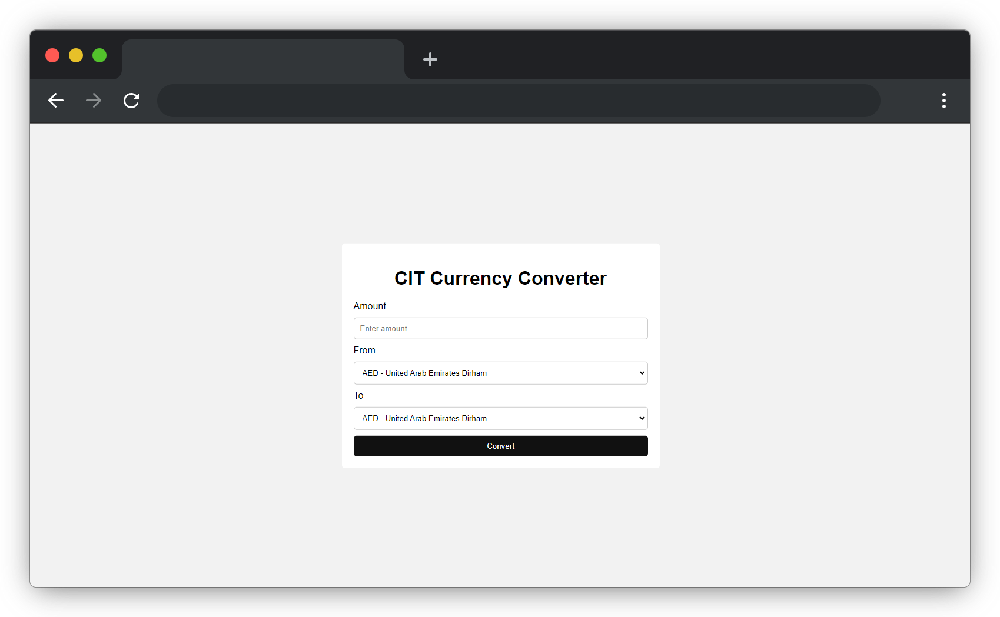

# CIT CURRENCY CONVERTER

This is a simple currency converter that converts from one currency to another. It uses the [Exchange Rates API](https://apilayer.com/marketplace/fixer-api#documentation-tab) to get the latest exchange rates.

## Installation

1. Clone the repository
2. Install the dependencies using `pip install -r requirements.txt`
3. Get an API key from [Exchange Rates API](https://apilayer.com/marketplace/fixer-api#documentation-tab)
4. create keys.py file and add the following line `API_KEY = 'YOUR_API_KEY'`
5. Run the app using `python app.py`
6. Open the browser and go to `http://localhost:5000/`

## Usage

1. Enter the amount to be converted
2. Select the source currency
3. Select the target currency
4. Click on convert
5. The converted amount will be displayed

## Screenshots

## Contributing

Pull requests are welcome. For major changes, please open an issue first to discuss what you would like to change.
