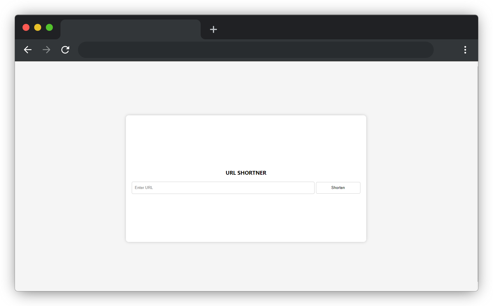

# URL SHORTNER
This is a simple URL shortner made using Flask and Mysql.


## Installation
1. Clone the repository
2. Install the requirements
```bash
pip install -r requirements.txt
```
3. Create a database in mysql and import the sql file

4. Change the database credentials in the db.yaml file

5. Run the app.py file
```bash
python app.py
```
6. Open the browser and go to http://localhost:5000

## Usage
1. Enter the URL in the input box and click on shorten
2. The shortened URL will be displayed
3. Click on the shortened URL to redirect to the original URL


## Screenshots


## Contributing
Pull requests are welcome. For major changes, please open an issue first to discuss what you would like to change.


