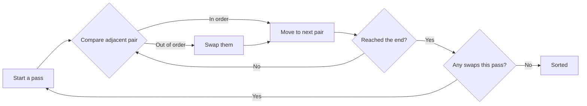

Bubble sort walks through the list comparing each pair of neighbours and swapping
them when they're out of order. After one full pass, the largest value has moved
all the way to the end — it has *bubbled* to the top, like air rising through
water. Repeat on the shrinking unsorted part until everything is in place.

It's the easiest sort to understand and the one you should never use.

## Watching one pass

Sorting `[5, 1, 4, 2, 8]`, comparing each adjacent pair left to right:

```
[5, 1, 4, 2, 8]   compare 5 and 1 → swap
[1, 5, 4, 2, 8]   compare 5 and 4 → swap
[1, 4, 5, 2, 8]   compare 5 and 2 → swap
[1, 4, 2, 5, 8]   compare 5 and 8 → leave
[1, 4, 2, 5, 8]   ← end of pass 1; 8 is now final
```

The largest element is guaranteed to be at the end. Pass 2 only has to look at
the first four positions:

```
[1, 4, 2, 5, 8]   compare 1 and 4 → leave
[1, 4, 2, 5, 8]   compare 4 and 2 → swap
[1, 2, 4, 5, 8]   compare 4 and 5 → leave
[1, 2, 4, 5, 8]   ← end of pass 2; 5 and 8 final
```

Pass 3 makes no swaps at all. The list is sorted.



## The code

```python
def bubble_sort(numbers: list) -> list:
    n = len(numbers)

    # each pass places one more element at its final position
    for i in range(n):
        # the last i items are already sorted, so stop early
        for j in range(n - i - 1):
            if numbers[j] > numbers[j + 1]:
                # swap — Python does this without a temp variable
                numbers[j], numbers[j + 1] = numbers[j + 1], numbers[j]

    return numbers


print(bubble_sort([-2, 45, 0, 11, -9]))
# [-9, -2, 0, 11, 45]
```

Two things to notice:

- `numbers[j], numbers[j+1] = numbers[j+1], numbers[j]` swaps in one line. Other
  languages need a temporary variable; Python builds a
  [tuple](/docs/week2/tuples) and unpacks it.
- The inner range shrinks by `i` each pass, because the tail is already sorted.
  Without that, you'd redo work you've already finished.

Change `>` to `<` to sort descending.

## The optimised version

The code above always runs every pass, even on a list that was sorted from the
start. Track whether any swap happened; if a whole pass passes without one,
you're done.

```python
def bubble_sort(numbers: list) -> list:
    n = len(numbers)

    for i in range(n):
        swapped = False

        for j in range(n - i - 1):
            if numbers[j] > numbers[j + 1]:
                numbers[j], numbers[j + 1] = numbers[j + 1], numbers[j]
                swapped = True

        # no swaps means everything is already in order
        if not swapped:
            break

    return numbers
```

This is what makes bubble sort's *best* case O(n): an already-sorted list takes
one pass. Its average and worst cases are still O(n²).

## Cost

| Case | Time | Why |
| :- | :- | :- |
| Best (already sorted) | O(n) | one pass, no swaps, early exit |
| Average | O(n²) | roughly n passes over n items |
| Worst (reverse sorted) | O(n²) | every comparison swaps |
| Extra memory | O(1) | sorts in place |

Stable: yes — equal elements are never swapped past each other.

## When to use it

Never, in real code. Use [`sorted()`](/docs/week6/sorting#what-to-actually-use).

Bubble sort earns its place as the first algorithm you trace by hand, because
every step is visible. [Insertion sort](/docs/week6/insertion-sort) is just as
simple to write and meaningfully better, so if you want a hand-written simple
sort, use that one.

## Rules

1. **Only adjacent elements are ever compared or swapped.**
2. **Each pass places one more element at its final position**, so pass *i* can stop *i* elements from the end.
3. **A pass with no swaps means the list is sorted** — that check is what gives the O(n) best case.
4. **It sorts in place**, using O(1) extra memory.
5. **It is stable**, because equal neighbours are never swapped — the comparison must stay `>`, not `>=`.
6. **Worst and average case are O(n²).** Don't use it on real data.

## Common Mistakes

- Letting the inner loop run to the end every pass, redoing work on the already-sorted tail.
- Off-by-one in `range(n - i - 1)`, giving an `IndexError` on `numbers[j + 1]`.
- Leaving out the `swapped` flag and losing the O(n) best case.
- Using a temporary variable to swap when `a, b = b, a` does it in one line.
- Changing `>` to `>=` and silently breaking stability.

## Practice

1. Trace one full pass of bubble sort on `[3, 1, 4, 1, 5]`, writing the list
   after each comparison.
2. Add a `print(numbers)` at the end of each outer loop iteration and run it on
   ten random numbers. Watch the sorted tail grow.
3. How many passes does the optimised version take on an already-sorted list?
   On a reverse-sorted one? Verify by counting.
4. Modify it to sort descending.

## Keep going

<Cards>
  <Card title="Selection Sort" href="/docs/week6/selection-sort" description="Next: a different simple approach." />
  <Card title="Sorting Algorithms" href="/docs/week6/sorting" description="Back to the comparison table." />
</Cards>
