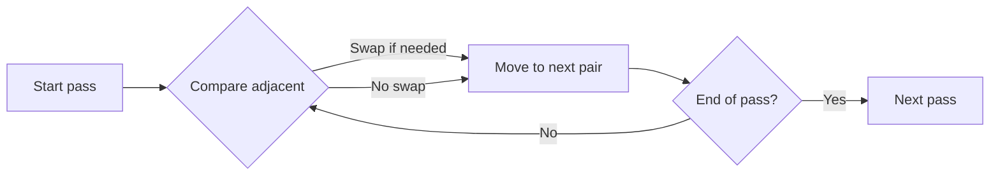
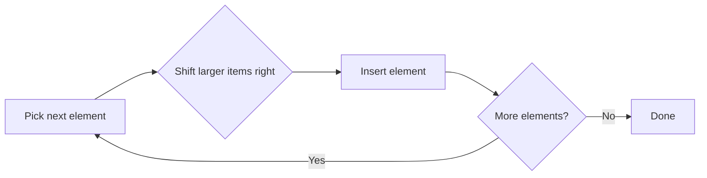

# Data Structures and Algorithms

Data structures organize data; algorithms are step-by-step procedures to solve
problems. Together, they help you write efficient programs.

<Callout type="info">
For beginners: first understand **what** a structure does, then **why** it helps
with certain problems.
</Callout>

## Data Structures
Common structures you should know:
- **Stack**: last-in, first-out (LIFO)
- **Queue**: first-in, first-out (FIFO)
- **Linked List**: nodes connected by references

**Real‑world intuition**
- Stack: undo history in an editor.
- Queue: line at a checkout counter.
- Linked list: train cars connected in order.

**Example use cases**
- Stack: browser back/forward, expression evaluation.
- Queue: task scheduling, printer jobs, messaging systems.
- Linked list: implementing a music playlist where you insert/remove often.

<Tabs>
<Tab value="stack" title="Stack">
A stack is like a pile of plates. You add to the top and remove from the top.

```python
stack = []
stack.append(1)
stack.append(2)
print(stack.pop())  # 2
```
</Tab>
<Tab value="queue" title="Queue">
A queue is like a line. The first person in line is served first.

```python
from collections import deque

queue = deque()
queue.append(1)
queue.append(2)
print(queue.popleft())  # 1
```
</Tab>
<Tab value="linked-list" title="Linked List">
A linked list stores items in nodes, each pointing to the next.

```python
class Node:
    def __init__(self, value, next_node=None):
        self.value = value
        self.next = next_node

head = Node(1, Node(2, Node(3)))
print(head.value)       # 1
print(head.next.value)  # 2
```
</Tab>
</Tabs>

## Algorithms
Common sorting algorithms:
- **Bubble sort**
- **Insertion sort**
- **Selection sort**
- **Merge sort**
- **Quick sort**

<Callout type="tip">
Use built-in sorting unless you’re learning how algorithms work.
</Callout>

### Example: Bubble Sort (Short)
```python
def bubble_sort(nums):
    for i in range(len(nums) - 1):
        for j in range(len(nums) - 1 - i):
            if nums[j] > nums[j + 1]:
                nums[j], nums[j + 1] = nums[j + 1], nums[j]
    return nums

print(bubble_sort([5, 2, 4, 1]))
```

**Explanation**
- Bubble sort repeatedly compares **neighboring** elements and swaps them if they are out of order.
- After one full pass, the **largest** element ends up at the end of the list.
- Then it repeats the process on the remaining items, so the unsorted part gets smaller each time.
- **Analogy:** like bubbles rising to the top of a glass, the biggest number rises to the end after each pass.

**Walkthrough (one pass)**
For `[5, 2, 4, 1]`:
- Compare `5` and `2` → swap → `[2, 5, 4, 1]`
- Compare `5` and `4` → swap → `[2, 4, 5, 1]`
- Compare `5` and `1` → swap → `[2, 4, 1, 5]`
Now `5` is in its final position.



### Example: Insertion Sort (Short)
```python
def insertion_sort(nums):
    for i in range(1, len(nums)):
        key = nums[i]
        j = i - 1
        while j >= 0 and nums[j] > key:
            nums[j + 1] = nums[j]
            j -= 1
        nums[j + 1] = key
    return nums

print(insertion_sort([5, 2, 4, 1]))
```

**Explanation**
- Insertion sort builds a **sorted section** on the left, one item at a time.
- It takes the next item and shifts larger items to the right until it finds the correct spot.
- This is efficient for nearly‑sorted lists because it does minimal movement.
- **Analogy:** like sorting cards in your hand, you insert each new card into its correct spot.

**Walkthrough (first two insertions)**
For `[5, 2, 4, 1]`:
- Start with `5` as sorted.
- Insert `2`: shift `5` right → `[2, 5, 4, 1]`
- Insert `4`: shift `5` right → `[2, 4, 5, 1]`



## When to Use What
- Use built-ins like `list.sort()` unless you’re learning algorithms.
- Choose data structures based on access pattern (LIFO, FIFO, random access).

**Quick choices**
- Need to add/remove from both ends? Use `deque`.
- Need fast membership tests? Use a `set`.
- Need ordered key/value storage? Use `dict`.

## Practice
1. Implement a queue using only a Python list.
2. Implement a stack with `push`, `pop`, and `peek`.
3. Sort a list of names using `sorted()` and reverse order.

## Mini Exercises
1. Given `[3, 1, 4, 1, 5]`, show one pass of bubble sort.
2. Implement `peek()` for a stack without removing the top item.
3. Write a function `is_palindrome(text)` using a stack.

## Common Mistakes
- Re-read the example and trace values step by step.
- Use small inputs to test your logic first.
- Add print statements to confirm assumptions.

## Quick Quiz
1. Explain the main idea in your own words.
2. Give one practical use case.
3. Name one common mistake and how to avoid it.

## Beginner Tips
- Focus on understanding **behavior** before worrying about performance.
- Draw small examples on paper to follow pointers and steps.
