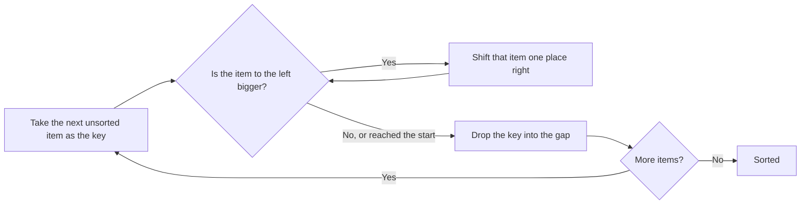

Insertion sort is how people actually sort a hand of playing cards. You hold a
sorted hand, pick up the next card, and slide it back past the cards larger than
it until it's in the right spot.

The first item counts as a sorted hand of one. Everything after it gets inserted.

## Watching it work

Sorting `[5, 2, 4, 1]`. The `|` marks the end of the sorted section.

```
  5 | 2  4  1     take 2 — it's less than 5, so shift 5 right and insert
  2  5 | 4  1     take 4 — less than 5, shift 5 right; not less than 2, stop
  2  4  5 | 1     take 1 — less than 5, 4, and 2; shifts all the way to front
  1  2  4  5 |    sorted
```

Zooming in on that third step:

```
sorted: [2, 4, 5]   next item: 1   (call it the key)

  compare 1 with 5 → 5 is bigger, shift it right:  [2, 4, _, 5]
  compare 1 with 4 → 4 is bigger, shift it right:  [2, _, 4, 5]
  compare 1 with 2 → 2 is bigger, shift it right:  [_, 2, 4, 5]
  reached the front → drop the key in the gap:     [1, 2, 4, 5]
```

Items are **shifted**, not swapped. The key sits in a variable until its slot
opens up.



## The code

```python
def insertion_sort(numbers: list) -> list:
    # position 0 is a sorted list of one, so start at 1
    for step in range(1, len(numbers)):
        key = numbers[step]        # the item we're placing
        j = step - 1               # the last item in the sorted section

        # shift everything bigger than key one place to the right
        while j >= 0 and numbers[j] > key:
            numbers[j + 1] = numbers[j]
            j -= 1

        # j+1 is now the gap where key belongs
        numbers[j + 1] = key

    return numbers


print(insertion_sort([-2, 45, 0, 11, -9]))
# [-9, -2, 0, 11, 45]
```

The `while` loop has two exit conditions, and both matter:

- `j >= 0` — you've reached the front of the list, so the key is the new minimum
- `numbers[j] > key` fails — you've found something smaller, so stop here

Change `>` to `<` to sort descending.

## Cost

| Case | Time | Why |
| :- | :- | :- |
| Best (already sorted) | O(n) | the `while` never runs; one comparison each |
| Average | O(n²) | each key shifts past about half the sorted section |
| Worst (reverse sorted) | O(n²) | every key shifts all the way to the front |
| Extra memory | O(1) | sorts in place |

Stable: yes — the condition is `>` not `>=`, so an equal item stops the shift and
the key lands *after* it.

## When to use it

This is the one simple sort with real uses:

- **Small lists.** Below roughly 10–20 items it beats merge and quick sort,
  because it has almost no overhead. Production sorts — including Python's
  Timsort — switch to insertion sort for small chunks.
- **Nearly-sorted data.** If each item is only a place or two out, the `while`
  loop barely runs and the whole thing is close to O(n).
- **Streaming input.** You can insert items as they arrive, keeping the list
  sorted at all times. The other four need the whole list up front.

<Callout type="info">
Python's built-in sort is Timsort, a hybrid of
[merge sort](/docs/week6/merge-sort) and insertion sort. It finds already-ordered
runs in the data, extends them with insertion sort, and merges them. That's why
it's so fast on real-world data, which is rarely random.
</Callout>

## Rules

1. **Position 0 starts as a sorted list of one**, so the loop begins at index 1.
2. **Elements are shifted right, not swapped**, while the key is held aside.
3. **The inner loop stops on the first element not greater than the key**, or at the start of the list.
4. **The comparison must be `>`, not `>=`, to stay stable.**
5. **Best case is O(n) on already-sorted input; worst is O(n²) on reversed input.**
6. **It sorts in place** and works on a stream — you can insert items as they arrive.

## Common Mistakes

- Starting the outer loop at 0 instead of 1.
- Forgetting to save the key before shifting, so it gets overwritten.
- Writing the key back to `j` instead of `j + 1` after the loop.
- Dropping the `j >= 0` guard, giving a negative index that silently wraps to the end of the list.
- Swapping instead of shifting, doing three times the writes.

## Practice

1. Trace insertion sort on `[5, 2, 4, 6, 1, 3]`, writing the list after each key
   is placed.
2. Count the shifts on a sorted list vs a reverse-sorted list of the same length.
3. Why is the condition `numbers[j] > key` rather than `>=`? Change it and test
   with `[(1, 'a'), (1, 'b')]` — what happens to stability?
4. Write a `sorted_insert(sorted_list, value)` function that inserts a single
   item into an already-sorted list.

## Keep going

<Cards>
  <Card title="Merge Sort" href="/docs/week6/merge-sort" description="Next: your first divide-and-conquer algorithm." />
  <Card title="Selection Sort" href="/docs/week6/selection-sort" description="The previous one." />
  <Card title="Sorting Algorithms" href="/docs/week6/sorting" description="Back to the comparison table." />
</Cards>
