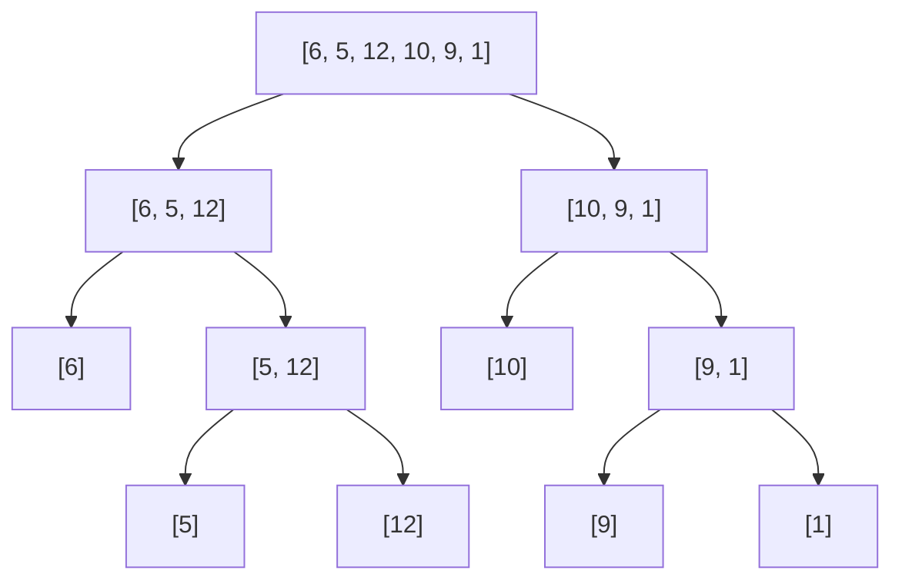

Merge sort is the first algorithm here that isn't obvious, and the first that's
genuinely fast. It's built on one idea: **merging two already-sorted lists into
one sorted list is easy.**

If that's easy, then sorting is easy too — split the list in half, sort each half
(the same way), and merge the results. The halves get smaller until they're one
item long, and a one-item list is already sorted. That's the base case.

This pattern — break a problem into smaller copies of itself, solve those, and
combine — is called **divide and conquer**. It needs
[recursion](/docs/week3/recursion).

## The three steps

<Steps>
<Step title="Divide">
Split the list at the midpoint into a left half and a right half.
</Step>
<Step title="Conquer">
Sort each half by calling merge sort on it. Keep splitting until a half has one
item, which is sorted by definition.
</Step>
<Step title="Combine">
Merge the two sorted halves into a single sorted list.
</Step>
</Steps>

## Watching it split and merge

Sorting `[6, 5, 12, 10, 9, 1]`:

```
                [6, 5, 12, 10, 9, 1]
                   /            \            ← divide
         [6, 5, 12]              [10, 9, 1]
          /      \                /      \
       [6]    [5, 12]          [10]    [9, 1]
               /    \                   /   \
             [5]   [12]               [9]   [1]   ← base case: one item

             [5]   [12]               [9]   [1]
               \    /                   \   /     ← merge
              [5, 12]                   [1, 9]
          \      /                \       /
         [5, 6, 12]              [1, 9, 10]
                   \            /
                [1, 5, 6, 9, 10, 12]
```

Everything on the way down is splitting. Everything on the way up is merging.



## How merging works

Two sorted lists, and a pointer into each. Compare the two items the pointers
are on, take the smaller, advance that pointer. Repeat until one list runs dry,
then copy whatever's left of the other.

```
L = [5, 12]        M = [1, 9]        result = []
     ^                  ^
compare 5 and 1 → take 1, advance M       result = [1]
compare 5 and 9 → take 5, advance L       result = [1, 5]
compare 12 and 9 → take 9, advance M      result = [1, 5, 9]
M is empty → copy the rest of L           result = [1, 5, 9, 12]
```

Because both inputs are sorted, the smallest item overall is always at one of the
two pointers. That's why a single pass is enough.

## The code

```python
def merge_sort(numbers: list) -> None:
    """Sort `numbers` in place."""
    if len(numbers) <= 1:
        return                      # base case: nothing to do

    middle = len(numbers) // 2
    left = numbers[:middle]
    right = numbers[middle:]

    merge_sort(left)                # conquer
    merge_sort(right)

    # --- combine: merge left and right back into numbers ---
    i = j = k = 0                   # i → left, j → right, k → numbers

    while i < len(left) and j < len(right):
        if left[i] < right[j]:
            numbers[k] = left[i]
            i += 1
        else:
            numbers[k] = right[j]
            j += 1
        k += 1

    # one side is exhausted; copy whatever remains from the other
    while i < len(left):
        numbers[k] = left[i]
        i += 1
        k += 1

    while j < len(right):
        numbers[k] = right[j]
        j += 1
        k += 1


data = [6, 5, 12, 10, 9, 1]
merge_sort(data)
print(data)   # [1, 5, 6, 9, 10, 12]
```

<Callout type="info">
The two trailing `while` loops look redundant, but exactly one of them runs. When
the first loop ends, one side is empty and the other still has items — all of
them larger than everything placed so far, and already in order.
</Callout>

### A shorter version that returns a new list

Easier to read, though it allocates more:

```python
def merge_sort(numbers: list) -> list:
    if len(numbers) <= 1:
        return numbers

    middle = len(numbers) // 2
    left = merge_sort(numbers[:middle])
    right = merge_sort(numbers[middle:])

    return merge(left, right)


def merge(left: list, right: list) -> list:
    result = []
    i = j = 0

    while i < len(left) and j < len(right):
        if left[i] < right[j]:
            result.append(left[i])
            i += 1
        else:
            result.append(right[j])
            j += 1

    result.extend(left[i:])
    result.extend(right[j:])
    return result


print(merge_sort([6, 5, 12, 10, 9, 1]))
```

## Cost

| Case | Time | Why |
| :- | :- | :- |
| Best | O(n log n) | it always splits all the way down |
| Average | O(n log n) | same |
| Worst | O(n log n) | same — no bad inputs |
| Extra memory | O(n) | the halves are copies |

Where `n log n` comes from: halving repeatedly gives about `log₂ n` levels
(6 items → 3 levels; 1,000,000 items → 20). Each level merges all `n` items once.

Stable: yes — `left[i] < right[j]` means ties take from the left, preserving
original order.

## When to use it

Merge sort's selling point is that it has **no worst case**. Quick sort is often
faster but can degrade to O(n²); merge sort is O(n log n) on every input.

It's the standard choice when:

- Performance must be predictable
- The data is too large for memory and must be sorted in chunks on disk
- Stability is required
- You're sorting a [linked list](/docs/week6/linked-lists), which merges without
  any extra memory at all

Its cost is the O(n) extra memory, which is why
[quick sort](/docs/week6/quick-sort) is often preferred for in-memory arrays.

## Rules

1. **The base case is a list of 0 or 1 elements.** Use `<= 1`, not `== 1`, or an empty list recurses forever.
2. **Both halves must be sorted before merging.** The merge step depends on it.
3. **Merging compares only the front element of each half**, which is why one pass suffices.
4. **After the main merge loop, exactly one half still has elements.** They must be copied across.
5. **It needs O(n) extra memory** for the halves.
6. **It is O(n log n) in every case** — there is no bad input.
7. **It is stable** as long as ties take from the left half (`left[i] <= right[j]`).

## Common Mistakes

- Using `== 1` as the base case, so an empty list recurses forever.
- Forgetting the two trailing copy loops and losing the tail of one half.
- Merging into a new list but never writing it back to the original.
- Using `<` instead of `<=` when comparing halves, breaking stability.
- Expecting it to sort in place — it needs O(n) extra memory.

## Practice

1. Draw the split-and-merge tree for `[38, 27, 43, 3, 9, 82, 10]`.
2. Merge `[1, 4, 9]` and `[2, 3, 10]` by hand, writing each comparison.
3. Add a `print` at the start of `merge_sort` showing the list it received. Run
   it and read the order the calls happen in.
4. Why is the base case `len(numbers) <= 1` rather than `== 1`? What input would
   break the `== 1` version?

<Accordions>
<Accordion title="Answer to question 4">
An empty list. `merge_sort([])` with `== 1` would split into two empty halves and
recurse forever. `<= 1` catches both the one-item and zero-item cases.
</Accordion>
</Accordions>

## Keep going

<Cards>
  <Card title="Quick Sort" href="/docs/week6/quick-sort" description="Next: the other divide-and-conquer sort." />
  <Card title="Recursion" href="/docs/week3/recursion" description="Week 3: the technique this relies on." />
  <Card title="Sorting Algorithms" href="/docs/week6/sorting" description="Back to the comparison table." />
</Cards>
