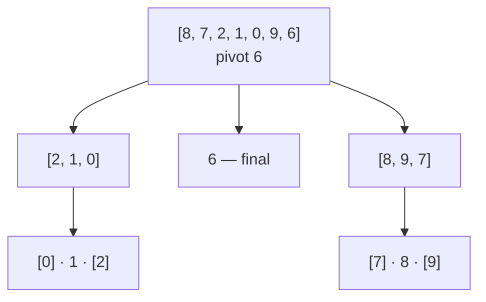

Quick sort is also [divide and conquer](/docs/week6/merge-sort), but it divides
differently. Instead of splitting down the middle and merging afterwards, it does
the work *before* recursing.

Pick one item — the **pivot**. Rearrange the list so everything smaller sits to
its left and everything larger sits to its right. The pivot is now in its final
position, forever. Then sort the left part and the right part the same way.

There's no merge step. When the recursion finishes, the list is already sorted.

## The two halves of the idea

<Steps>
<Step title="Partition">
Choose a pivot and rearrange the section around it. Return where the pivot landed.
</Step>
<Step title="Recurse">
Quick sort the part left of the pivot, and the part right of it. Stop when a
section has fewer than two items.
</Step>
</Steps>

## Watching a partition

Sorting `[8, 7, 2, 1, 0, 9, 6]` with the **last** element as the pivot, so
pivot = `6`.

We keep a boundary `i` marking the end of the "smaller than pivot" region, and
scan with `j`:

```
pivot = 6                     i = -1
[8, 7, 2, 1, 0, 9, 6]

j=0: 8 > 6 → leave it
j=1: 7 > 6 → leave it
j=2: 2 ≤ 6 → i becomes 0, swap positions 0 and 2
     [2, 7, 8, 1, 0, 9, 6]
j=3: 1 ≤ 6 → i becomes 1, swap positions 1 and 3
     [2, 1, 8, 7, 0, 9, 6]
j=4: 0 ≤ 6 → i becomes 2, swap positions 2 and 4
     [2, 1, 0, 7, 8, 9, 6]
j=5: 9 > 6 → leave it

finally: swap the pivot into position i+1 = 3
     [2, 1, 0, 6, 8, 9, 7]
                ^ pivot is home and never moves again
```

Everything left of `6` is smaller; everything right is larger. Neither side is
sorted yet — that's the recursion's job:

```
[2, 1, 0] | 6 | [8, 9, 7]
    ↓              ↓
quick sort      quick sort
```



## The code

```python
def partition(numbers: list, low: int, high: int) -> int:
    """Rearrange numbers[low..high] around a pivot, return the pivot's index."""
    pivot = numbers[high]      # choose the rightmost element
    i = low - 1                # end of the "smaller than pivot" region

    for j in range(low, high):
        if numbers[j] <= pivot:
            i += 1
            numbers[i], numbers[j] = numbers[j], numbers[i]

    # put the pivot just after the smaller region
    numbers[i + 1], numbers[high] = numbers[high], numbers[i + 1]
    return i + 1


def quick_sort(numbers: list, low: int = 0, high: int | None = None) -> list:
    if high is None:
        high = len(numbers) - 1

    if low < high:
        pivot_index = partition(numbers, low, high)
        quick_sort(numbers, low, pivot_index - 1)    # left of the pivot
        quick_sort(numbers, pivot_index + 1, high)   # right of the pivot

    return numbers


data = [8, 7, 2, 1, 0, 9, 6]
print(quick_sort(data))
# [0, 1, 2, 6, 7, 8, 9]
```

The pivot itself is excluded from both recursive calls — it's already where it
belongs.

### A short, readable version

Not how you'd implement it in production (it copies instead of sorting in place),
but it makes the idea unmistakable:

```python
def quick_sort(numbers: list) -> list:
    if len(numbers) <= 1:
        return numbers

    pivot = numbers[len(numbers) // 2]

    smaller = [n for n in numbers if n < pivot]
    equal   = [n for n in numbers if n == pivot]
    larger  = [n for n in numbers if n > pivot]

    return quick_sort(smaller) + equal + quick_sort(larger)


print(quick_sort([8, 7, 2, 1, 0, 9, 6]))
```

## Cost

| Case | Time | When |
| :- | :- | :- |
| Best | O(n log n) | the pivot lands near the middle every time |
| Average | O(n log n) | random data |
| Worst | O(n²) | the pivot is always the smallest or largest item |
| Extra memory | O(log n) | the recursion stack |

Stable: **no**. Partitioning swaps distant elements past each other.

### The worst case is real

With "last element" as the pivot, an **already-sorted list** is the worst
possible input. Every partition puts zero items on one side, so instead of
halving you peel off one item at a time: n levels of recursion, O(n²) work, and
a `RecursionError` on a large list.

Real implementations avoid this by choosing the pivot better:

```python
import random
pivot_index = random.randint(low, high)
numbers[pivot_index], numbers[high] = numbers[high], numbers[pivot_index]
```

or by taking the median of the first, middle, and last elements.

## Quick sort vs merge sort

| | Quick sort | [Merge sort](/docs/week6/merge-sort) |
| :- | :- | :- |
| Worst case | O(n²) | O(n log n) |
| Extra memory | O(log n) | O(n) |
| Stable | no | yes |
| Speed in practice | usually faster | consistent |

Quick sort usually wins on in-memory arrays because it sorts in place and has
excellent cache behaviour. Merge sort wins when you can't tolerate a bad case, or
need stability.

<Callout type="info">
Python's `sorted()` uses neither — it uses Timsort, which is merge sort plus
[insertion sort](/docs/week6/insertion-sort), chosen because it's stable and
exploits ordered runs in real data.
</Callout>

## Rules

1. **After partitioning, the pivot is in its final position** and is excluded from both recursive calls.
2. **Everything left of the pivot is `<=` it and everything right is `>=` it** — neither side is sorted yet.
3. **Recurse only while `low < high`.** A section of 0 or 1 elements is already sorted.
4. **It sorts in place**, using O(log n) stack space for the recursion.
5. **The worst case is O(n²)**, and with a last-element pivot it's triggered by *already-sorted* input.
6. **Randomise the pivot or use median-of-three** to make that worst case unlikely.
7. **It is not stable.** Partitioning swaps distant elements.

## Common Mistakes

- Including the pivot in a recursive call, so the recursion never shrinks.
- Returning the wrong index from `partition` and splitting at the wrong point.
- Using a last-element pivot on sorted data and hitting O(n²) plus `RecursionError`.
- Forgetting the final swap that moves the pivot into position.
- Assuming it's stable. It isn't.

## Practice

1. Partition `[9, 4, 7, 2, 8]` by hand with `8` as the pivot. Where does it land?
2. Add a `print(numbers)` at the end of `partition` and sort ten random numbers.
   Watch the pivots settle.
3. Run the in-place version on an already-sorted list of 20 items and count the
   `partition` calls. Compare with a shuffled list of the same length.
4. Add random pivot selection and repeat question 3. What changes?

## Keep going

<Cards>
  <Card title="Week 6 Recap" href="/docs/week6/recap" description="You've finished the algorithms — check yourself." />
  <Card title="Merge Sort" href="/docs/week6/merge-sort" description="The other divide-and-conquer sort." />
  <Card title="Sorting Algorithms" href="/docs/week6/sorting" description="Back to the comparison table." />
</Cards>
