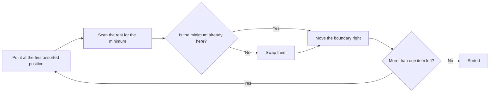

Selection sort splits the list into two parts: a sorted section at the front, and
everything else. On each pass it scans the unsorted part for the smallest value
and swaps it into the first unsorted position. The sorted section grows by one
each time.

## Watching it work

Sorting `[64, 25, 12, 22, 11]`. The `|` marks the boundary — everything left of
it is finished.

```
| 64  25  12  22  11     smallest is 11 → swap with position 0
  11 | 25  12  22  64    smallest of the rest is 12 → swap with position 1
  11  12 | 25  22  64    smallest of the rest is 22 → swap with position 2
  11  12  22 | 25  64    smallest of the rest is 25 → already there
  11  12  22  25 | 64    one item left, nothing to do
  11  12  22  25  64     sorted
```

Notice how few swaps that took — four passes, three actual swaps. That's the
one thing selection sort is genuinely good at.



## The code

```python
def selection_sort(numbers: list) -> list:
    n = len(numbers)

    for step in range(n):
        # assume the first unsorted item is the smallest
        min_index = step

        # then look through the rest for something smaller
        for i in range(step + 1, n):
            if numbers[i] < numbers[min_index]:
                min_index = i

        # put the smallest item at the front of the unsorted section
        numbers[step], numbers[min_index] = numbers[min_index], numbers[step]

    return numbers


print(selection_sort([-2, 45, 0, 11, -9]))
# [-9, -2, 0, 11, 45]
```

The inner loop doesn't swap anything — it only remembers *where* the smallest
value is. One swap happens per pass, after the scan finishes.

Change `<` to `>` to sort descending.

## Cost

| Case | Time | Why |
| :- | :- | :- |
| Best | O(n²) | the scan always runs in full |
| Average | O(n²) | same |
| Worst | O(n²) | same |
| Swaps | O(n) | at most one per pass |
| Extra memory | O(1) | sorts in place |

Stable: **no**. Swapping a distant minimum into place can jump an equal element
past another one.

<Callout type="info">
Selection sort is the only one of the five with no best case. It can't detect a
sorted list — it scans the whole unsorted section every pass regardless. Compare
[bubble sort](/docs/week6/bubble-sort), which exits after one pass on sorted
input.
</Callout>

## When to use it

When **writing** is expensive and comparing is cheap. Selection sort does at most
n swaps, far fewer than bubble or insertion sort. That mattered for flash memory
with limited write cycles; it rarely matters now.

Otherwise, [insertion sort](/docs/week6/insertion-sort) beats it on almost
every input.

## Rules

1. **Each pass scans the entire unsorted section** to find its minimum.
2. **At most one swap happens per pass**, giving O(n) swaps in total — its one advantage.
3. **It is O(n²) in every case.** There is no early exit, even on sorted input.
4. **It sorts in place**, using O(1) extra memory.
5. **It is not stable.** Swapping a distant minimum can reorder equal elements.
6. **The boundary only ever moves right.** Everything left of it is final.

## Common Mistakes

- Swapping inside the inner loop instead of tracking the index and swapping once at the end.
- Starting the inner scan at `step` rather than `step + 1`, so it compares an element with itself.
- Expecting an early exit on sorted input — there isn't one.
- Assuming it's stable. It isn't.

## Practice

1. Trace selection sort on `[29, 10, 14, 37, 13]`, writing the list after each
   pass.
2. Count the swaps for a list of 10 random numbers, then for a reverse-sorted
   list of 10. Is the count different? Why not?
3. Modify it to find the *maximum* and build the sorted section from the back
   instead.
4. Show that it's unstable: sort `[(1, 'a'), (1, 'b'), (0, 'c')]` by the first
   element and see what happens to `'a'` and `'b'`.

## Keep going

<Cards>
  <Card title="Insertion Sort" href="/docs/week6/insertion-sort" description="Next: the best of the simple three." />
  <Card title="Bubble Sort" href="/docs/week6/bubble-sort" description="The previous one." />
  <Card title="Sorting Algorithms" href="/docs/week6/sorting" description="Back to the comparison table." />
</Cards>
