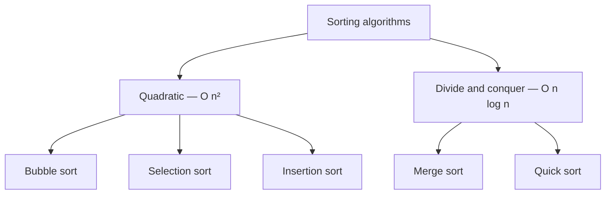

Sorting puts a collection in order. It's the standard teaching problem for
algorithms because the same task has many reasonable solutions, and the
differences between them are easy to see.

## The five, compared

| Algorithm | Best | Average | Worst | Extra memory | Stable | Good at |
| :- | :- | :- | :- | :- | :- | :- |
| [Bubble](/docs/week6/bubble-sort) | O(n) | O(n²) | O(n²) | O(1) | yes | teaching; nothing else |
| [Selection](/docs/week6/selection-sort) | O(n²) | O(n²) | O(n²) | O(1) | no | when writes are expensive |
| [Insertion](/docs/week6/insertion-sort) | O(n) | O(n²) | O(n²) | O(1) | yes | small or nearly-sorted data |
| [Merge](/docs/week6/merge-sort) | O(n log n) | O(n log n) | O(n log n) | O(n) | yes | predictable performance, big data |
| [Quick](/docs/week6/quick-sort) | O(n log n) | O(n log n) | O(n²) | O(log n) | no | general purpose, fast in practice |

**Stable** means two items that compare equal keep their original relative order.
It matters when you sort by one field after another — sort by name, then by
department, and a stable sort keeps names alphabetical within each department.

## Two families

The first three are **quadratic** sorts. They compare and swap within the list,
using no extra memory, and they all slow down badly as the list grows.



The last two are **divide and conquer**. They split the problem in half, solve
each half [recursively](/docs/week3/recursion), and combine the results. That
halving is where `log n` comes from, and it's why they stay usable on large
inputs.

## Suggested order

1. **[Bubble sort](/docs/week6/bubble-sort)** — the easiest to see. Start here.
2. **[Selection sort](/docs/week6/selection-sort)** — a different, equally simple idea.
3. **[Insertion sort](/docs/week6/insertion-sort)** — the best of the simple three, and genuinely used on small inputs.
4. **[Merge sort](/docs/week6/merge-sort)** — your first divide-and-conquer algorithm.
5. **[Quick sort](/docs/week6/quick-sort)** — the trickiest, and the one most often used in practice.

## What to actually use

```python
numbers = [5, 2, 9, 1]

numbers.sort()                          # sorts in place, returns None
ordered = sorted(numbers)               # returns a new list

sorted(numbers, reverse=True)           # descending
sorted(words, key=len)                  # by a computed key
sorted(people, key=lambda p: p["age"])  # see Lambda Functions
```

Python's built-in sort is **Timsort** — a hybrid of merge sort and insertion sort
designed around the fact that real data is often partly ordered already. It's
stable, it's O(n log n) worst case, and it's written in C. You will not beat it.

<Callout type="info">
`sort()` changes the list and returns `None`. `sorted()` leaves the original
alone and hands you a new list. Writing `numbers = numbers.sort()` sets
`numbers` to `None` — a very common beginner bug.
</Callout>

## Rules

1. **`list.sort()` sorts in place and returns `None`; `sorted()` returns a new list.** `x = x.sort()` sets `x` to `None`.
2. **Every element must be mutually comparable.** Sorting `[1, "a"]` raises `TypeError`.
3. **Use `key=` to sort by a computed value**, and `reverse=True` for descending. Never sort then reverse separately.
4. **`key=` is called once per element**, unlike a comparison function.
5. **Python's sort is stable**, so equal elements keep their order — which is what makes sorting by successive keys work.
6. **A general comparison sort cannot beat O(n log n).**
7. **In-place sorts use O(1) extra memory; merge sort needs O(n).**

## Common Mistakes

- Writing `numbers = numbers.sort()` and getting `None`.
- Sorting then reversing, instead of passing `reverse=True`.
- Calling a function in `key=` that returns a different type for different elements.
- Assuming a sort is stable when the algorithm doesn't guarantee it.
- Implementing one of these five in real code instead of using `sorted()`.

## Practice

1. Sort `["banana", "kiwi", "apple"]` by length, then alphabetically. 
2. Sort a list of dicts by one key, then re-sort by another. Does the first
   ordering survive within groups? What does that tell you about Timsort?
3. Before reading the algorithm pages: how would *you* sort a shuffled deck of
   cards? Which of the five is it closest to?

## Keep going

<Cards>
  <Card title="Bubble Sort" href="/docs/week6/bubble-sort" description="Start with the simplest." />
  <Card title="Data Structures and Algorithms" href="/docs/week6/data-structures-and-algorithms" description="Back to the week overview." />
  <Card title="Recursion" href="/docs/week3/recursion" description="Needed for merge and quick sort." />
</Cards>
