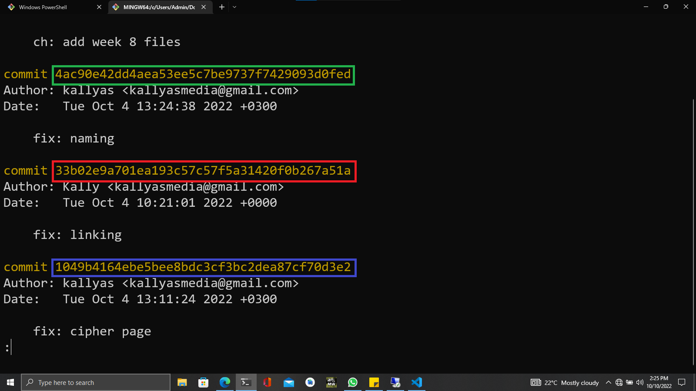

Cryptographic hash functions (like SHA-256 and SHA3-256) are used in many scenarios. Let's review their most common applications.

# Hash Functions - Integrity Verification
Verifying the integrity of files / documents / messages. E.g. a SHA256 checksum may confirm that certain file is original (not modified after its checksum was calculated).

The above screenshot demonstrates how the SHA256 checksums ensure the integrity of the OpenSSL files at the official Web site of OpenSSL.

# Hash Functions - Storing Passwords
Storing passwords in a database. E.g. a SHA256 hash of a password may be stored in a database, and the password may be verified by comparing the hash of the password entered by the user with the hash stored in the database.

The above screenshot demonstrates how the SHA256 hashes are used to store passwords in the Linux shadow file.

# Hash Functions - Generate Unique Identifiers
Generate an (almost) unique ID of certain document / message. Cryptographic hash functions almost uniquely identify documents based on their content. In theory collisions are possible with any cryptographic hash function, but are very unlikely to happen, so most systems (like Git) assume that the hash function they use is collistion free.
Usually a document is hashed and the document ID (hash value) is used later to prove the existence of the document, or to retrieve the document from a storage system. Example of hash-based unique IDs are the commit hashes in Git and GitHub, based on the content of the commit (e.g. 3c3be25bc1757ca99aba55d4157596a8ea217698) and the Bitcoin addresses (e.g. 1BvBMSEYstWetqTFn5Au4m4GFg7xJaNVN2).

The above screenshot demonstrates how the SHA-1 hashes are used to generate unique identifiers for commits in GitHub.